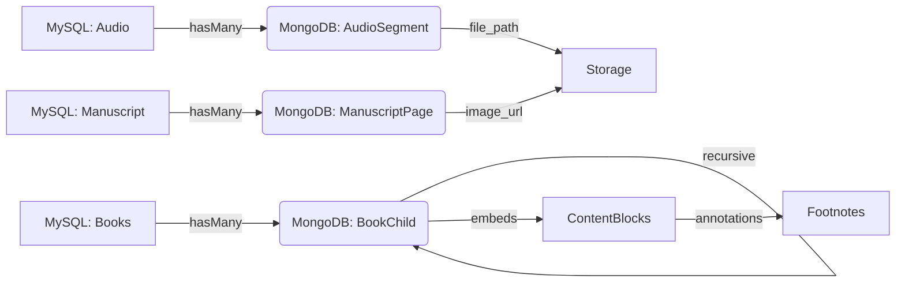
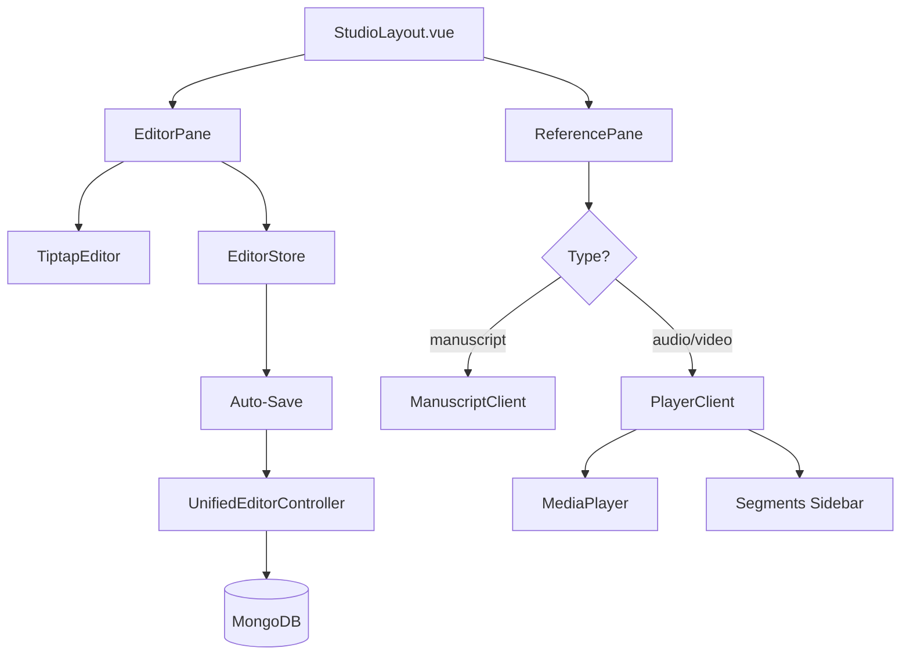

# Entity | Advanced Digital Asset Management System

[](https://laravel.com)
[](https://vuejs.org)
[](https://inertiajs.com)
[](https://www.mongodb.com)
[](https://tailwindcss.com)

**Entity** is a state-of-the-art digital library and multimedia asset management platform featuring a unique **Hybrid Database Architecture**. Designed for scholars, researchers, and content creators, it handles complex hierarchical content (Books, Manuscripts, Audio, Video) with a premium user experience and intelligent automated ingestion.

---

## 🌟 Key Features

### 🎬 Entity Studio - Unified Content Editor
A powerful, unified workspace for editing and managing all content types:
- **Split-Pane Interface**: Reference viewer (left) + Rich text editor (right)
- **Bundle Support**: Multi-file entities (Albums, Series, Multi-page Manuscripts)
- **Smart Navigation**: URL-based deep-linking to specific tracks, scenes, or pages
- **Auto-Save**: Persistent text content with real-time synchronization
- **Resume Functionality**: Automatically return to your last editing session

### 🧠 Intelligent Storage Sync
Automatically ingest and organize your library by simply uploading files:
- **Header-Based Hierarchy**: Automatically builds book navigation trees by parsing `#` headers in Markdown or `Heading` styles in Word (.docx)
- **Bundle Detection**: Recognizes folders as multi-file entities (e.g., `audios/AlbumName/` → Audio Bundle with tracks)
- **Automated Footnote Extraction**: Intelligently identifies and links footnotes from document internals
- **Multilingual Support**: Optimized for Arabic and International datasets with full RTL support

### 🏛️ Hybrid Database Architecture
Leverages the best of both worlds:
- **MySQL (PostgreSQL compatible)**: Manages relational metadata, authors, categories, and authentication
- **MongoDB**: Handles deep, recursive, and unstructured hierarchical content for lightning-fast navigation

### 📖 Modern Reader Experience
- **Recursive Sidebar**: Persistent, searchable tree-view with smooth transitions
- **Drag-and-Drop Reordering**: Rearrange volumes and chapters directly in the UI
- **Glassmorphism Design**: High-end aesthetic with full Dark Mode and fluid micro-interactions
- **Media Player**: Advanced audio/video player with A-B loop, playback speed control, and segment markers

---

## 🛠 Tech Stack

- **Backend:** Laravel 11 (PHP 8.2+)
- **Frontend:** Vue.js 3 (Composition API) + Inertia.js 
- **Styling:** Tailwind CSS v4.0
- **Databases:** MySQL / PostgreSQL (Relational) + MongoDB (Document)
- **Rich Text:** Tiptap Editor with custom extensions (Heritage Poetry, Quranic Verses, Scientific Footnotes)
- **Media:** Custom Vue components with native HTML5 audio/video APIs

---

## 🚀 Getting Started

### Prerequisites
- PHP >= 8.2
- Composer
- Node.js & NPM
- MongoDB Server (Running locally or via Atlas)
- MySQL or PostgreSQL

### Installation

1. **Clone the repository:**
   ```bash
   git clone [repository-url]
   cd Entity
   ```

2. **Install Dependencies:**
   ```bash
   composer install
   npm install
   ```

3. **Environment Setup:**
   ```bash
   cp .env.example .env
   php artisan key:generate
   ```
   
   **Configure your `.env` file:**
   ```env
   # MySQL/PostgreSQL
   DB_CONNECTION=mysql
   DB_HOST=127.0.0.1
   DB_PORT=3306
   DB_DATABASE=entity
   DB_USERNAME=root
   DB_PASSWORD=

   # MongoDB
   MONGODB_URI=mongodb://localhost:27017
   MONGODB_DATABASE=entity_content
   ```

4. **Run Migrations & Seeding:**
   ```bash
   php artisan migrate --seed
   ```

5. **Sync Storage (Import Sample Data):**
   ```bash
   php artisan storage:sync
   ```
   This will scan `storage/app/public/` for books, manuscripts, audio, and video files and automatically import them.

6. **Start the Development Servers:**
   ```bash
   # Terminal 1: Frontend
   npm run dev
   
   # Terminal 2: Backend
   php artisan serve
   
   # Terminal 3: MongoDB (if running locally)
   mongod --dbpath .mongo/db --logpath .mongo/log/mongod.log
   ```

7. **Access the Application:**
   - Frontend: `http://localhost:8000`
   - Login: `admin@admin.com` / `admin`

---

## 📚 Core Concepts

### Entity Types
- **Books**: Text-based content with hierarchical chapters
- **Manuscripts**: Image-based historical documents with page-by-page viewing
- **Audio**: Audio files or albums (bundles) with transcription support
- **Video**: Video files or series (bundles) with scene-based editing

### Bundle System
Folders in `storage/app/public/` are automatically detected as bundles:
```
storage/app/public/
├── audios/
│   ├── MyAlbum/          # → Audio Bundle
│   │   ├── Track1.mp3
│   │   └── Track2.mp3
├── videos/
│   ├── MySeries/         # → Video Bundle
│   │   ├── Episode1.mp4
│   │   └── Episode2.mp4
└── manuscripts/
    └── HistoricalDoc/    # → Manuscript Bundle
        ├── page-01.jpg
        └── page-02.jpg
```

### Studio Navigation
Access any content node directly via URL:
```
/studio/{type}/{slug}

Examples:
/studio/audio/track1-abc123
/studio/manuscript/page-02-xyz789
/studio/book/chapter-introduction
```

---

## 🧪 Testing

The project maintains a rigorous test suite:

- **Backend / Feature Tests:**
  ```bash
  php artisan test
  ```
  
- **Browser (E2E) Tests:**
  ```bash
  php artisan dusk
  ```

---

## 📐 Technical Architecture

### Hybrid Database Linkage

Entity uses a custom `HybridRelations` trait to seamlessly link items across MySQL and MongoDB:



### Studio Architecture



---

## 🎯 Key Commands

```bash
# Import files from storage
php artisan storage:sync

# Seed realistic sample data
php artisan db:seed --class=SeedRealisticData

# Fresh start (reset database)
php artisan migrate:fresh --seed

# Run all tests
php artisan test && php artisan dusk
```

---

## 🤝 Contributing

Contributions are welcome! Please feel free to submit a Pull Request.

---

## 📜 License

This project is open-source software licensed under the [MIT license](LICENSE).

---

## 🙏 Acknowledgments

Built with modern web technologies and best practices for digital humanities and multimedia content management.
