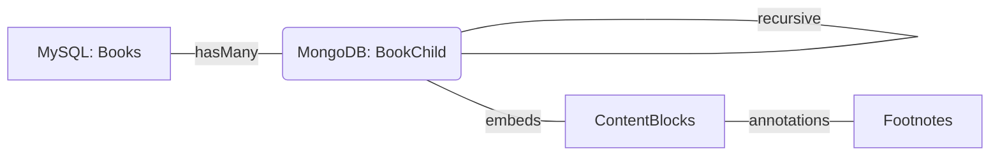

# Entity | Advanced Digital Asset Management System

[](https://laravel.com)
[](https://vuejs.org)
[](https://inertiajs.com)
[](https://www.mongodb.com)
[](https://tailwindcss.com)

**Entity** is a state-of-the-art digital library and asset management platform featuring a unique **Hybrid Database Architecture**. It is designed to handle complex hierarchical content (Books, Manuscripts, Media) with a premium user experience and intelligent automated ingestion.

---

## 🌟 Key Features

### 🧠 Intelligent Storage Sync
Automatically ingest and organize your library by simply uploading files.
- **Header-Based Hierarchy**: Automatically builds book navigation trees by parsing `#` headers in Markdown or `Heading` styles in Word (.docx).
- **Automated Footnote Extraction**: Intelligently identifies and links footnotes from document internals (`[^1]` tags or Word's `footnotes.xml`) to specific text paragraphs.
- **Multilingual Support**: Optimized for Arabic and International datasets with full RTL support.

### 🏛️ Hybrid Database Architecture
Leverages the best of both worlds:
- **MySQL (PostgreSQL compatible)**: Manages relational metadata, authors, categories, and authentication.
- **MongoDB**: Handles deep, recursive, and unstructured hierarchical content for lightning-fast reader navigation.

### 📖 Modern Reader Experience
- **Recursive Sidebar**: Persistent, searchable tree-view with smooth transitions.
- **Drag-and-Drop Reordering**: Rearrange volumes and chapters directly in the UI with instant saving.
- **Glassmorphism Design**: High-end aesthetic with full Dark Mode and fluid micro-interactions.

---

## 🛠 Tech Stack

- **Backend:** Laravel 11 (PHP 8.2+)
- **Frontend:** Vue.js 3 (Composition API) + Inertia.js 
- **Styling:** Tailwind CSS v4.0
- **Databases:** MySQL / PostgreSQL (Relational) + MongoDB (Document)
- **Real-time:** Ziggy Routes + LocalStorage State Persistence

---

## 🚀 Getting Started

### Prerequisites
- PHP >= 8.2
- Composer
- Node.js & NPM
- MongoDB Server (Running locally or via Atlas)

### Installation

1. **Clone the repository:**
   ```bash
   git clone [repository-url]
   cd Entity
   ```

2. **Install Dependencies:**
   ```bash
   composer install
   npm install
   ```

3. **Environment Setup:**
   ```bash
   cp .env.example .env
   php artisan key:generate
   ```
   *Note: Ensure your `DB_CONNECTION` (MySQL) and `MONGODB_URI` are correctly configured in `.env`.*

4. **Run Migrations & Seeding:**
   ```bash
   php artisan migrate --seed
   ```

5. **Start the Engines:**
   ```bash
   npm run dev
   # In another terminal:
   php artisan serve
   ```

---

## 🧪 Testing

The project maintains a rigorous test suite with 200+ assertions:

- **Backend / Feature Tests**:
  ```bash
  php artisan test
  ```
- **Browser (E2E) Tests**:
  ```bash
  php artisan dusk
  ```

---

## 📐 Technical Overview: Hybrid Linkage

Entity uses a custom `HybridRelations` trait to link items across different database engines. 



When a book is created in MySQL, a corresponding hierarchical root is initialized in MongoDB. Deletions are handled via Observers to maintain strict referential integrity across drivers.

---

## 📜 License
This project is open-source software licensed under the [MIT license](LICENSE).
