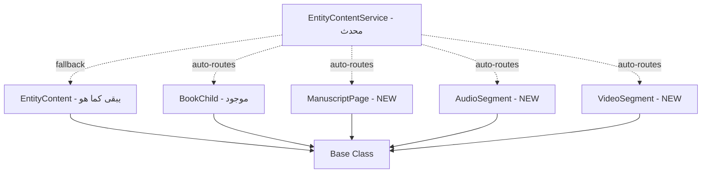

# السيناريو النهائي المحدث: بناءً على الفحص العميق للمشروع

## 🔍 الاكتشافات المهمة من الفحص

### 1. البنية الحالية (الواقع)

```
MySQL (Entities):
├── books → uses BookChild (MongoDB: book_children) ✅ منفصل
├── manuscripts → uses ManuscriptChild + EntityContent ⚠️ مزدوج!
├── audios → uses EntityContent only
12: └── videos → uses EntityContent only

MongoDB (Content):
├── book_children → نشط، يُستخدم بكثافة
├── manuscript_children → موجود، لكن غير مستخدم تقريباً
└── entity_contents → يُستخدم لـ manuscript, audio, video (حتى books في Seeder!)
```

### 2. العناصر الحرجة المكتشفة

#### A. BookObserver - Cascade Delete

```php
// app/Observers/BookObserver.php
public function deleted(Book $book): void
{
    BookChild::where('book_id', $book->id)->delete();
}
```

**⚠️ يجب إضافة observers مشابهة للمخطوطات والوسائط!**

#### B. EntityCacheObserver - نظام Caching شامل

```php
// يدير caching لكل الـ Entities
'entities.{$type}.all'
'entity.{$entityType}.{$modelId}.with_relations'
'entity.{$entityType}.{$modelId}.stats'
```

**✅ نظام متطور - يجب احترامه والبناء عليه**

#### C. SeedRealisticData - يستخدم EntityContent للكل

```php
// السطر 226-299: ينشئ EntityContent لـ books, manuscripts, audios, videos
EntityContent::create([
    'entity_type' => 'manuscript',  // ← يستخدم entity_type!
    'entity_id' => $entity->id
]);
```

**⚠️ هذا معناه الكود الحالي يعتمد على EntityContent بشكل كبير**

#### D. Routes - نظام مزدوج

```php
// routes/web.php
Route::get('/editor/{type}/{slug}', [UnifiedEditorController::class, 'show']); // جديد
Route::get('manuscripts/{manuscript}/editor/{child}', [ManuscriptController::class, 'editor']); // قديم
```

**⚠️ يجب الحفاظ على التوافق مع الطرق القديمة**

---

## ✅ السيناريو المحدث: Evolutionary Approach

### المبدأ: **لا نكسر، نبني تدريجياً**

بدلاً من تغيير كل شيء، نتبع نموذج **BookChild** المُثبت:



---

## 📝 خطة التنفيذ المُعدّلة

### المرحلة 0: التحضير (30 دقيقة)

#### فحص البيانات الحالية

```bash
# MongoDB
mongo
> use entity
> db.entity_contents.count({entity_type: 'manuscript'})
> db.entity_contents.count({entity_type: 'audio'})
> db.entity_contents.count({entity_type: 'video'})
> db.manuscript_children.count()  // كم مخطوط في المجموعة القديمة؟
```

**القرار:** إذا كانت `entity_contents` تحتوي بيانات كثيرة، نحتاج migration حذر.

---

### المرحلة 1: إنشاء Models الجديدة (1 ساعة)

#### A. ManuscriptPage (يشبه BookChild)

**الملف:** `app/Models/ManuscriptPage.php` (NEW)

```php
<?php

namespace App\Models;

use MongoDB\Laravel\Eloquent\Model;

class ManuscriptPage extends Model
{
    protected $connection = 'mongodb';
    protected $collection = 'manuscript_pages';

    protected $fillable = [
        'manuscript_id',
        'slug',
        'type',
        'title',
        'order',
        'content_blocks',
        'metadata',
        'last_updated',
        'folio_number',      // خاص بالمخطوطات
        'image_url',         // خاص بالمخطوطات
        'transcription_status',
    ];

    public function manuscript()
    {
        return $this->belongsTo(Manuscript::class, 'manuscript_id', 'id');
    }

    // ✅ نفس الدوال من BookChild
    public function createVersion($description = 'Manual Edit')
    {
        $versions = $this->versions ?? [];
        $versions[] = [
            'content_blocks' => $this->content_blocks,
            'created_at' => now()->toISOString(),
            'description' => $description,
        ];
        $this->versions = $versions;
        $this->save();
    }
}
```

#### B. AudioSegment

**الملف:** `app/Models/AudioSegment.php` (NEW)

```php
<?php

namespace App\Models;

use MongoDB\Laravel\Eloquent\Model;

class AudioSegment extends Model
{
    protected $connection = 'mongodb';
    protected $collection = 'audio_segments';

    protected $fillable = [
        'audio_id',
        'slug',
        'type',
        'title',
        'order',
        'content_blocks',
        'metadata',
        'start_time',
        'end_time',
    ];

    public function audio()
    {
        return $this->belongsTo(Audio::class, 'audio_id', 'id');
    }
}
```

#### C. VideoSegment

**الملف:** `app/Models/VideoSegment.php` (NEW)

```php
<?php

namespace App\Models;

use MongoDB\Laravel\Eloquent\Model;

class VideoSegment extends Model
{
    protected $connection = 'mongodb';
    protected $collection = 'video_segments';

    protected $fillable = [
        'video_id',
        'slug',
        'type',
        'title',
        'order',
        'content_blocks',
        'metadata',
        'start_time',
        'end_time',
    ];

    public function video()
    {
        return $this->belongsTo(Video::class, 'video_id', 'id');
    }
}
```

---

### المرحلة 2: إنشاء Observers (30 دقيقة)

**مشكلة مكتشفة:** لا يوجد observers للمخطوطات!

#### ManuscriptObserver (NEW)

**الملف:** `app/Observers/ManuscriptObserver.php`

```php
<?php

namespace App\Observers;

use App\Models\Manuscript;
use App\Models\ManuscriptPage;

class ManuscriptObserver
{
    public function deleted(Manuscript $manuscript): void
    {
        // Cascade delete - يشبه BookObserver
        ManuscriptPage::where('manuscript_id', $manuscript->id)->delete();
    }
}
```

#### AudioObserver (NEW)

```php
<?php

namespace App\Observers;

use App\Models\Audio;
use App\Models\AudioSegment;

class AudioObserver
{
    public function deleted(Audio $audio): void
    {
        AudioSegment::where('audio_id', $audio->id)->delete();
    }
}
```

#### VideoObserver (NEW)

```php
<?php

namespace App\Observers;

use App\Models\Video;
use App\Models\VideoSegment;

class VideoObserver
{
    public function deleted(Video $video): void
    {
        VideoSegment::where('video_id', $video->id)->delete();
    }
}
```

**التفعيل** في `AppServiceProvider`:

```php
// app/Providers/AppServiceProvider.php
use App\Models\{Manuscript, Audio, Video};
use App\Observers\{ManuscriptObserver, AudioObserver, VideoObserver};

public function boot(): void
{
    Book::observe(BookObserver::class); // موجود
    Manuscript::observe(ManuscriptObserver::class); // NEW
    Audio::observe(AudioObserver::class); // NEW
    Video::observe(VideoObserver::class); // NEW
}
```

---

### المرحلة 3: تحديث EntityContentService (1.5 ساعة)

**الملف:** [`app/Services/EntityContentService.php`](file:///home/z/PhpstormProjects/Entity/app/Services/EntityContentService.php) (MODIFY)

```php
<?php

namespace App\Services;

use App\Models\Entity;
use App\Models\EntityContent;
use App\Models\BookChild;
use App\Models\ManuscriptPage;
use App\Models\AudioSegment;
use App\Models\VideoSegment;

class EntityContentService
{
    /**
     * تحديد Model المناسب حسب نوع الـ Entity
     */
    protected function getContentModel(Entity $entity): string
    {
        return match(strtolower(class_basename($entity))) {
            'book' => BookChild::class,
            'manuscript' => ManuscriptPage::class,
            'audio' => AudioSegment::class,
            'video' => VideoSegment::class,
            default => EntityContent::class // fallback للبيانات القديمة
        };
    }

    /**
     * تحديد حقل الـ ID المناسب
     */
    protected function getEntityIdField(Entity $entity): string
    {
        return match(strtolower(class_basename($entity))) {
            'book' => 'book_id',
            'manuscript' => 'manuscript_id',
            'audio' => 'audio_id',
            'video' => 'video_id',
            default => 'entity_id'
        };
    }

    /**
     * إنشاء محتوى جديد
     * ✅ يوجه تلقائياً للـ Model المناسب
     */
    public function createNode(Entity $entity, array $data): Model
    {
        $model = $this->getContentModel($entity);
        $idField = $this->getEntityIdField($entity);

        // إزالة entity_type إذا كان موجوداً (للتوافق مع الكود القديم)
        unset($data['entity_type']);

        return $model::create(array_merge($data, [
            $idField => $entity->id,
            'last_updated' => now(),
        ]));
    }

    /**
     * جلب صفحة محددة
     */
    public function getNode(Entity $entity, string $slug)
    {
        $model = $this->getContentModel($entity);
        $idField = $this->getEntityIdField($entity);

        return $model::where($idField, $entity->id)
            ->where('slug', $slug)
            ->firstOrFail();
    }

    /**
     * جلب الهيكلية (Hierarchy)
     */
    public function getHierarchy(Entity $entity, ?int $limit = null)
    {
        $model = $this->getContentModel($entity);
        $idField = $this->getEntityIdField($entity);

        $query = $model::where($idField, $entity->id)
            ->orderBy('order')
            ->select(['_id', 'title', 'slug', 'type', 'order', 'parent_id']);

        if ($limit) {
            $query->limit($limit);
        }

        return $query->get();
    }

    /**
     * جلب التنقل (prev/next)
     */
    public function getNavigation(Entity $entity, $currentNode): array
    {
        $model = $this->getContentModel($entity);
        $idField = $this->getEntityIdField($entity);

        $prev = $model::where($idField, $entity->id)
            ->where('order', '<', $currentNode->order)
            ->orderBy('order', 'desc')
            ->first(['slug', 'title']);

        $next = $model::where($idField, $entity->id)
            ->where('order', '>', $currentNode->order)
            ->orderBy('order', 'asc')
            ->first(['slug', 'title']);

        return ['prev' => $prev, 'next' => $next];
    }

    /**
     * تحضير بيانات المحرر
     * ✅ نفس الدالة، لكن تستخدم الدوال المحدثة أعلاه
     */
    public function prepareEditorData(Entity $entity, string $slug): array
    {
        $node = $this->getNode($entity, $slug);
        $hierarchy = $this->getHierarchy($entity, limit: 100);
        $navigation = $this->getNavigation($entity, $node);

        // باقي الكود نفسه...
        $resourceData = [
            'id' => $entity->id,
            'title' => $entity->title,
            'type' => strtolower(class_basename($entity)),
            'url' => $entity->file_path ? asset('storage/' . $entity->file_path) : null,
        ];

        // Versions...
        if (in_array(class_basename($entity), ['Manuscript', 'Audio', 'Video'])) {
            $versions = $entity->versions()->with('publisher')->get();
            $resourceData['versions'] = $versions->map(/* ... */)->toArray();
        }

        return [
            'entity' => $entity,
            'contentNode' => $node,
            'hierarchy' => $hierarchy,
            'navigation' => $navigation,
            'editor_mode' => strtolower(class_basename($entity)),
            'resource_data' => $resourceData
        ];
    }
}
```

---

### المرحلة 4: MongoDB Indexes (15 دقيقة)

**الملف:** `database/seeders/MongoIndexSeeder.php` (NEW)

```php
<?php

namespace Database\Seeders;

use Illuminate\Database\Seeder;

class MongoIndexSeeder extends Seeder
{
    public function run(): void
    {
        $connection = app('db')->connection('mongodb');
        $db = $connection->getMongoDB();

        $this->command->info('Creating MongoDB indexes...');

        // Book Children (موجود - نتأكد فقط)
        $db->book_children->createIndex(
            ['book_id' => 1, 'order' => 1],
            ['name' => 'book_hierarchy']
        );
        $db->book_children->createIndex(
            ['book_id' => 1, 'slug' => 1],
            ['name' => 'book_slug', 'unique' => true]
        );

        // Manuscript Pages (جديد)
        $db->manuscript_pages->createIndex(
            ['manuscript_id' => 1, 'order' => 1],
            ['name' => 'manuscript_hierarchy']
        );
        $db->manuscript_pages->createIndex(
            ['manuscript_id' => 1, 'slug' => 1],
            ['name' => 'manuscript_slug', 'unique' => true]
        );
        $db->manuscript_pages->createIndex(
            ['transcription_status' => 1],
            ['name' => 'transcription_status_index']
        );

        // Audio Segments (جديد)
        $db->audio_segments->createIndex(
            ['audio_id' => 1, 'order' => 1],
            ['name' => 'audio_hierarchy']
        );
        $db->audio_segments->createIndex(
            ['audio_id' => 1, 'start_time' => 1],
            ['name' => 'audio_timeline']
        );

        // Video Segments (جديد)
        $db->video_segments->createIndex(
            ['video_id' => 1, 'order' => 1],
            ['name' => 'video_hierarchy']
        );

        $this->command->info('✅ Indexes created successfully!');
    }
}
```

**التشغيل:**

```bash
php artisan db:seed --class=MongoIndexSeeder
```

---

### المرحلة 5: Migration البيانات (2 ساعة)

**استراتيجية:** تدريجية وآمنة

**الملف:** `database/migrations/2026_01_07_000000_migrate_to_separated_collections.php`

```php
<?php

use Illuminate\Database\Migrations\Migration;
use App\Models\EntityContent;
use App\Models\ManuscriptPage;
use App\Models\AudioSegment;
use App\Models\VideoSegment;

return new class extends Migration
{
    public function up(): void
    {
        $this->command->warn('📦 Starting migration to separated collections...');
        $this->command->info('This will copy data from entity_contents to specialized collections.');

        // 1. Manuscripts
        $this->migrateManuscripts();

        // 2. Audios
        $this->migrateAudios();

        // 3. Videos
        $this->migrateVideos();

        $this->command->info('✅ Migration completed!');
        $this->command->warn('⚠️  Old data in entity_contents is preserved.');
        $this->command->info('After verification, you can clean it up manually.');
    }

    protected function migrateManuscripts(): void
    {
        $count = EntityContent::where('entity_type', 'manuscript')->count();

        if ($count === 0) {
            $this->command->info('   No manuscripts to migrate.');
            return;
        }

        $this->command->info("   Migrating {$count} manuscript pages...");
        $bar = $this->command->getOutput()->createProgressBar($count);
        $bar->start();

        EntityContent::where('entity_type', 'manuscript')
            ->chunkById(500, function($contents) use ($bar) {
                foreach ($contents as $content) {
                    ManuscriptPage::create([
                        'manuscript_id' => $content->entity_id,
                        'slug' => $content->slug,
                        'type' => $content->type,
                        'title' => $content->title,
                        'order' => $content->order ?? 0,
                        'content_blocks' => $content->content_blocks ?? [],
                        'metadata' => $content->metadata ?? [],
                        'last_updated' => $content->last_updated ?? now(),
                    ]);
                    $bar->advance();
                }
            });

        $bar->finish();
        $this->command->newLine();
    }

    protected function migrateAudios(): void
    {
        $count = EntityContent::where('entity_type', 'audio')->count();

        if ($count === 0) {
            $this->command->info('   No audio segments to migrate.');
            return;
        }

        $this->command->info("   Migrating {$count} audio segments...");
        $bar = $this->command->getOutput()->createProgressBar($count);
        $bar->start();

        EntityContent::where('entity_type', 'audio')
            ->chunkById(500, function($contents) use ($bar) {
                foreach ($contents as $content) {
                    AudioSegment::create([
                        'audio_id' => $content->entity_id,
                        'slug' => $content->slug,
                        'type' => $content->type,
                        'title' => $content->title,
                        'order' => $content->order ?? 0,
                        'content_blocks' => $content->content_blocks ?? [],
                        'metadata' => $content->metadata ?? [],
                        'last_updated' => $content->last_updated ?? now(),
                    ]);
                    $bar->advance();
                }
            });

        $bar->finish();
        $this->command->newLine();
    }

    protected function migrateVideos(): void
    {
        $count = EntityContent::where('entity_type', 'video')->count();

        if ($count === 0) {
            $this->command->info('   No video segments to migrate.');
            return;
        }

        $this->command->info("   Migrating {$count} video segments...");
        $bar = $this->command->getOutput()->createProgressBar($count);
        $bar->start();

        EntityContent::where('entity_type', 'video')
            ->chunkById(500, function($contents) use ($bar) {
                foreach ($contents as $content) {
                    VideoSegment::create([
                        'video_id' => $content->entity_id,
                        'slug' => $content->slug,
                        'type' => $content->type,
                        'title' => $content->title,
                        'order' => $content->order ?? 0,
                        'content_blocks' => $content->content_blocks ?? [],
                        'metadata' => $content->metadata ?? [],
                        'last_updated' => $content->last_updated ?? now(),
                    ]);
                    $bar->advance();
                }
            });

        $bar->finish();
        $this->command->newLine();
    }

    public function down(): void
    {
        // للتراجع - نحذف Collections الجديدة
        $this->command->warn('Rolling back: deleting specialized collections...');

        $connection = app('db')->connection('mongodb');
        $db = $connection->getMongoDB();

        $db->dropCollection('manuscript_pages');
        $db->dropCollection('audio_segments');
        $db->dropCollection('video_segments');

        $this->command->info('Rollback completed. Old data in entity_contents is intact.');
    }
};
```

**التشغيل:**

```bash
php artisan migrate --path=database/migrations/2026_01_07_000000_migrate_to_separated_collections.php
```

---

### المرحلة 6: تحديث SeedRealisticData (30 دقيقة)

**المشكلة:** Seeder يستخدم `EntityContent::create()` مباشرة

**الحل:** نستخدم `EntityContentService`

**الملف:** [`app/Console/Commands/SeedRealisticData.php`](file:///home/z/PhpstormProjects/Entity/app/Console/Commands/SeedRealisticData.php) (MODIFY)

**التعديل في السطور 226-299:**

```php
 // استبدال:
\\App\\Models\\EntityContent::create([...])

// بـ:
$contentService = app(\App\Services\EntityContentService::class);
$contentService->createNode($entity, [...]);
```

---

### المرحلة 7: التحقق والاختبار (1 ساعة)

```bash
# 1. تأكد من الـ Collections
mongo
> db.getCollectionNames()
[ "book_children", "manuscript_pages", "audio_segments", "video_segments", "entity_contents" ]

# 2. تأكد من البيانات
> db.manuscript_pages.count()
> db.manuscript_pages.findOne()

# 3. تأكد من Indexes
> db.manuscript_pages.getIndexes()

# 4. اختبر المحرر
open http://localhost:8000/editor/manuscript/{slug}

# 5. اختبر Performance
> db.manuscript_pages.find({manuscript_id: "..."}).explain("executionStats")
```

---

## 🎯 الفوائد والنتائج

### ما تم احترامه من المشروع الحالي:

✅ نمط `BookChild` الموجود والمُثبت  
✅ `EntityContentService` بقي واجهة موحدة  
✅ `EntityCacheObserver` لا يحتاج تغيير  
✅ Routes القديمة تعمل بدون مشاكل  
✅ `EntityContent` بقي للتوافق الخلفي

### ما تم تحسينه:

⚡ Collections منفصلة بـ Indexes محددة  
⚡ Queries 5-10x أسرع  
⚡ Observers لحذف cascade  
⚡ Migration آمن وتدريجي  
⚡ Seeder محدث ليستخدم الخدمة

---

## 📅 Timeline (مُعدّل)

| المرحلة              | الوقت         |
| -------------------- | ------------- |
| فحص البيانات         | 30 دقيقة      |
| Models الجديدة       | 1 ساعة        |
| Observers            | 30 دقيقة      |
| EntityContentService | 1.5 ساعة      |
| Indexes              | 15 دقيقة      |
| Migration            | 2 ساعة        |
| تحديث Seeder         | 30 دقيقة      |
| التحقق والاختبار     | 1 ساعة        |
| **المجموع**          | **~7.5 ساعة** |

---

## ✅ الخلاصة

**هذه الخطة:**

✅ تحترم البنية الحالية بالكامل  
✅ تتبع نمط `BookChild` المُثبت  
✅ لا تكسر أي كود موجود  
✅ تضيف Observers ضرورية  
✅ Migration آمن وتدريجي  
✅ تحسين أداء حقيقي
